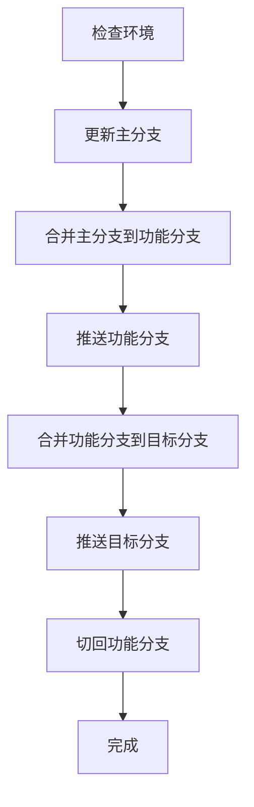

# Git合并助手 - JetBrains插件

> 🚀 一个强大的Git分支合并工具，帮助开发者自动化复杂的分支合并流程，提高开发效率。


## ✨ 主要功能

### 🚀 自动化分支合并
- **一键完成** Feature分支到目标分支的完整合并流程
- **智能流程** 自动更新主分支 → 合并主分支到功能分支 → 合并功能分支到目标分支
- **自动推送** 合并完成后自动推送到远程仓库
- **分支切换** 操作完成后自动切回原始分支

### ⚡ 快速提交合并
- **快速提交** 一键提交未提交的更改
- **可选合并** 提交后可选择继续执行自动合并流程
- **输入验证** 提交信息长度限制和格式验证

### 🔍 智能分支检测
- **模式匹配** 根据配置的命名规则自动识别功能分支
- **预设模式** 支持 `feature/*`、`feat/*`、`bugfix/*`、`hotfix/*`、`fix/*`
- **自定义规则** 支持添加自定义分支命名模式

### 🛠️ 冲突处理
- **智能检测** 自动检测Git合并冲突
- **友好提示** 提供冲突解决指导和选项
- **状态监控** 实时监控冲突解决状态

### ⚙️ 灵活配置
- **主分支设置** 支持配置 main、master、develop 等主分支
- **目标分支管理** 可添加、删除和编辑目标分支列表
- **分支模式配置** 自定义功能分支命名规则
- **项目级配置** 支持不同项目使用不同配置

### 🔒 安全可靠
- **并发控制** 防止多个合并操作同时执行
- **环境验证** 全面的Git环境和配置验证
- **操作回滚** 操作失败时的自动恢复机制

## 📦 安装方法

### 从JetBrains Marketplace安装
1. 打开IntelliJ IDEA或其他JetBrains IDE
2. 进入 `Settings/Preferences` → `Plugins`
3. 搜索 "Git合并助手"
4. 点击 `Install` 安装插件
5. 重启IDE

### 从源码构建
```bash
# 克隆项目
git clone https://github.com/your-repo/git-merge-helper-v2.git
cd git-merge-helper-v2

# 构建插件
./gradlew buildPlugin

# 安装构建的插件
# 插件文件位于: build/distributions/git-merge-helper-v2-1.0.0.zip
```

## 🚀 使用方法

### 1. 基本配置
首次使用前，需要配置插件设置：

1. 打开 `Settings/Preferences` → `Tools` → `Git合并助手`
2. 配置主分支名称（如：main、master）
3. 添加目标分支（如：main、develop、release）
4. 配置功能分支命名模式（默认已包含常用模式）

### 2. 自动合并分支
在功能分支上执行自动合并：

**方法一：命令面板**
- 按 `Ctrl+Shift+P` 打开命令面板
- 搜索 "自动合并分支"
- 选择目标分支执行合并

**方法二：菜单操作**
- 在菜单栏选择 `VCS` → `Git合并助手` → `自动合并分支`
- 或使用快捷键 `Ctrl+Shift+M`

**方法三：右键菜单**
- 在项目树或编辑器中右键
- 选择 `Git合并助手` → `自动合并分支`

### 3. 快速提交
当有未提交的更改时：

1. 选择 `快速提交并合并`
2. 输入提交消息
3. 选择是否继续执行自动合并
4. 如果选择继续，再选择目标分支

### 4. 查看状态
随时查看当前Git状态和配置信息：
- 选择 `Git合并助手` → `查看状态`
- 显示当前分支、配置验证结果等信息

## ⚙️ 配置选项

### 主分支配置
设置项目的主分支，用于合并前的更新操作：
- **main** (默认)
- **master**
- **develop**
- 或其他自定义主分支

### 目标分支配置
配置可合并的目标分支列表：
```
main (主分支)
develop (开发分支)
release (发布分支)
staging (测试分支)
```

### 功能分支模式
配置功能分支的命名规则：
```
feature/*
feat/*
bugfix/*
hotfix/*
fix/*
```

## 🔄 工作流程

插件执行的自动合并流程：



## 🛠️ 开发环境

### 环境要求
- **JDK**: 17+
- **Gradle**: 8.0+
- **IntelliJ IDEA**: 2023.2+
- **Git**: 2.0+

### 本地开发
```bash
# 克隆项目
git clone https://github.com/your-repo/git-merge-helper-v2.git
cd git-merge-helper-v2

# 运行开发环境
./gradlew runIde

# 运行测试
./gradlew test

# 构建插件
./gradlew buildPlugin
```

### 项目结构
```
src/main/kotlin/com/gitmergehelper/
├── actions/          # 用户操作
├── model/           # 数据模型
├── services/        # 核心服务
├── settings/        # 配置界面
└── utils/           # 工具类
```

## 📝 更新日志

### 版本 1.0.0 (2024-01-XX)
- ✨ 初始版本发布
- 🚀 实现自动化分支合并功能
- ⚡ 支持快速提交合并
- 🔍 添加智能分支检测
- 🛠️ 实现合并冲突处理
- ⚙️ 提供完整的配置管理系统
- 🔒 添加安全控制和环境验证

## 🤝 贡献

欢迎提交问题和功能请求！

1. Fork 项目
2. 创建功能分支 (`git checkout -b feature/amazing-feature`)
3. 提交更改 (`git commit -m 'Add amazing feature'`)
4. 推送到分支 (`git push origin feature/amazing-feature`)
5. 打开 Pull Request

## 📄 许可证

本项目采用 MIT 许可证 - 查看 [LICENSE](LICENSE) 文件了解详情。

## 🙏 致谢

- 感谢 JetBrains 提供强大的IDE平台和开发工具
- 感谢 Git 团队为版本控制提供的优秀工具
- 感谢所有为开源社区做出贡献的开发者

## 📞 支持

如果您在使用过程中遇到问题或有任何建议，请：

1. 查看 [FAQ](docs/FAQ.md)
2. 搜索 [已知问题](https://github.com/your-repo/git-merge-helper-v2/issues)
3. 提交新的 [Issue](https://github.com/your-repo/git-merge-helper-v2/issues/new)
4. 发送邮件至：support@gitmergehelper.com

---

**让Git合并变得简单而高效！** 🎉 